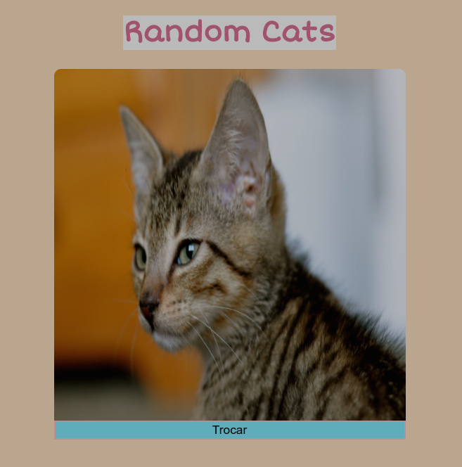

# Random Cats 

Este Projeto foi criado para colocar em prática meus conhecimentos adquiridos sobre consume de API com Fetch e tratamento de funções assíncronas com async/await.

Utilizei da uma API REST pública (thecatapi) que retorna informações aleatorias sobre gatinhos, incluindo imagens, aproveitando isso criari uma pagina que gera imagens aleatorias desses gatinhos.

Link:https://allanfernds.github.io/random-cats/

## Layout do projeto

### Autor

LinkedIn: https://www.linkedin.com/in/alan-fernandes-03096317b/

Instagram: https://www.instagram.com/_alanfernds/

E-mail: alanfernandes.mm@gmail.com

